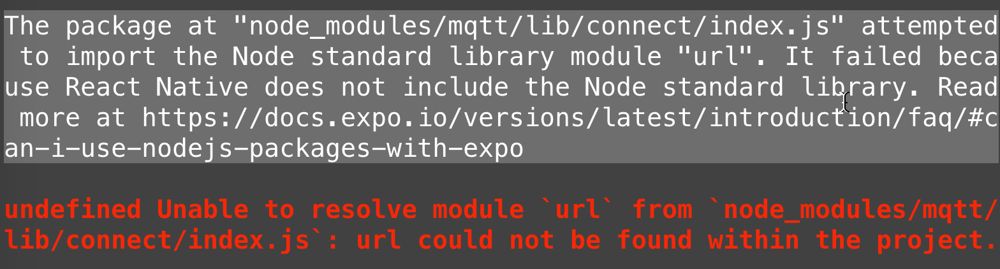
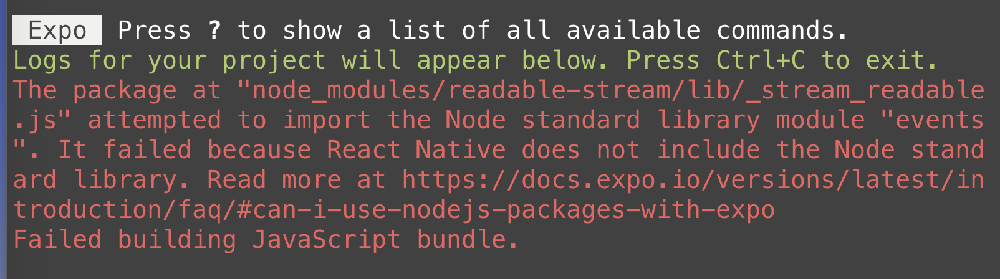
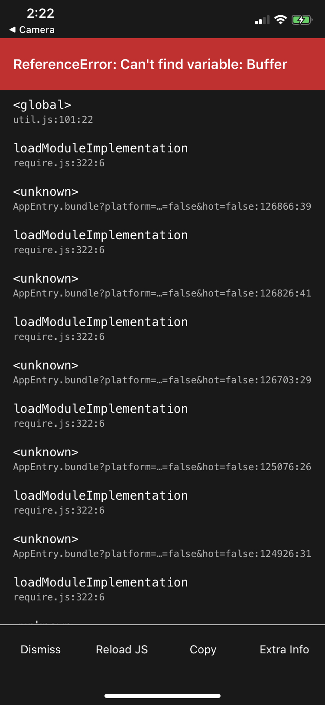

# react-native-mqtt-starter

If you try using [MQTT.js](https://github.com/mqttjs) in a React Native project, you'll see this error...



And then if you fix that one you'll see this one...



And if you keep slogging through the errors you'll eventually get to a point where it seems like you may succeed, but not really because...



Node has both packages and certain globals that modules may expect, such as url, stream, Buffer or process. React Native does not include these Node.js core modules standard library provide these globals, because uses [JavaSciptCore](https://docs.expo.io/versions/latest/react-native/javascript-environment/) as its JavaScript engine and not [V8](<https://en.wikipedia.org/wiki/V8_(JavaScript_engine)>).

I was able to fix this problem by using a library called [node-libs-react-native](https://github.com/parshap/node-libs-react-native), which is a fork of [node-libs-browser](https://github.com/webpack/node-libs-browser) with a few packages swapped to be compatible in React Native.

## Getting Started

Read the [React Native docs](https://reactnative.dev/docs/environment-setup) if you've never started a project before. These docs will walk you through how to use a platform called [Expo](https://expo.io/) to bundle your code and serve it to an Android or iOS device using a locally running server. It's pretty slick!

### Less words more code, please

#### (1) First, clone this repo and install Expo's cli and the node modules for this project.

```
git clone https://github.com/andrew-j-roberts/react-native-mqtt-starter.git
npm install -g expo-cli
cd react-native-mqtt-starter
yarn install
```

#### (2) Then, fill in [mqtt-client-config.js](/mqtt-client-config.js) with your MQTT connection details.

If you don't have an MQTT broker handy, I recommend spinning up a free (no credit card required) managed messaging service using Solace PubSub+ Cloud.

Follow the instructions [here](https://console.solace.cloud/login/new-account) to sign up for an account.

#### (3) After you fill in the MQTT connection details, start up Expo and scan the QR code from a device of your choosing.

```
npm start
```
